# ImageAnalyzer: AWS Rekognition Demo

This repository contains the code for the ImageAnalyzer application that I live-coded in my MLH Show and Tell talk on **"Leveraging AWS Rekognition to build ML Powered WebApps"**. The application is a simple tool which takes in an image input from the user, and performs Object Detection, PPE Detection, and Face Analysis (Gender, Age, Emotion, Facial Wear, and a lot of other things) on the image using AWS Rekognition. In addition to AWS Rekognition, AWS API Gateway and AWS Lambda services are used. The code for the lambda function (with NodeJS as runtime) can be found in the `functions/recognise` directory.

## Screenshots
Here are some screenshots of the results on a few sample images as input.

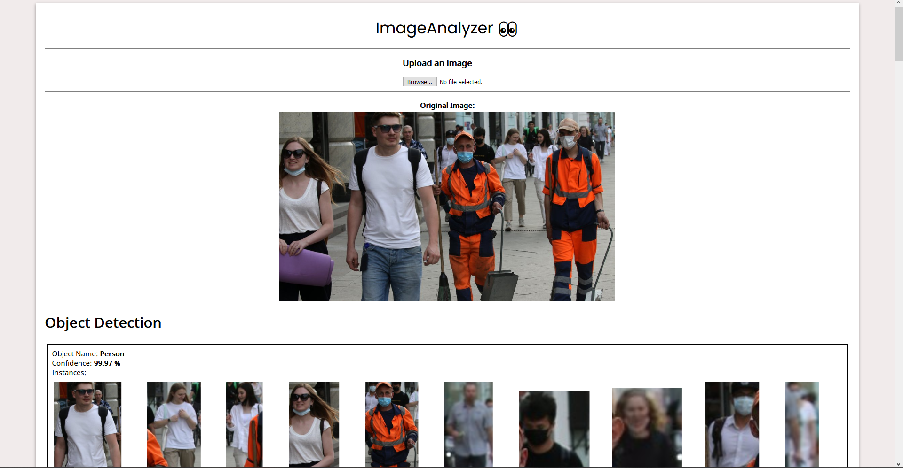
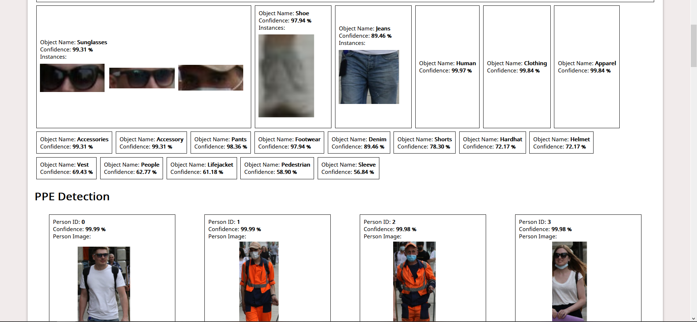
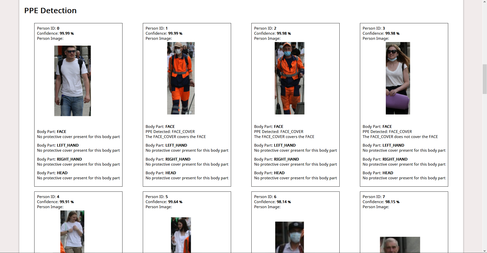
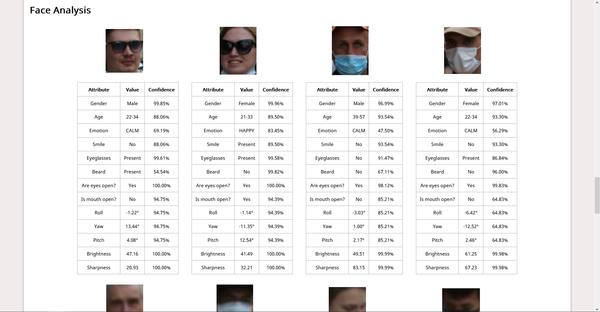
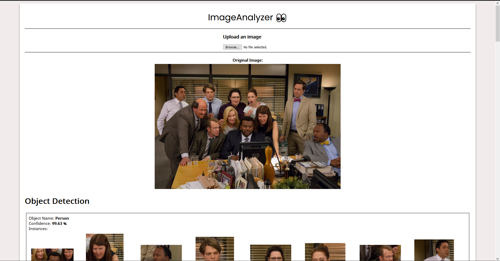
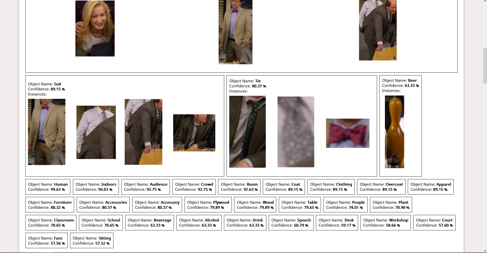
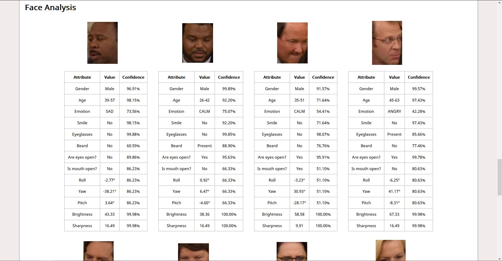
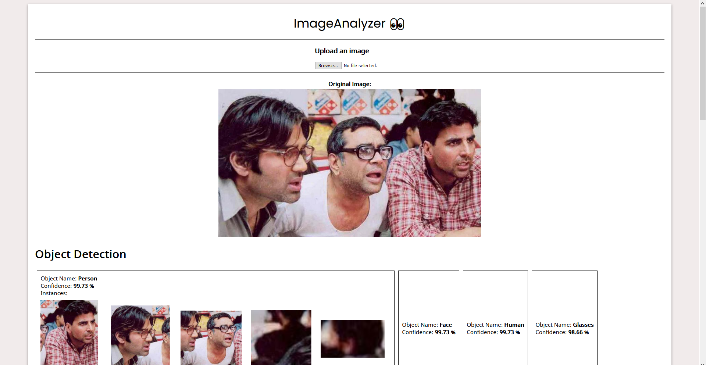
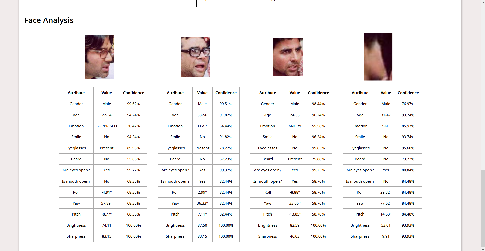

## Notes from the talk

- What are we building?
    - A very simple webapp which will take image input from user and perform various kinds of computer vision analysis operations on it, and show us the results.
    - We will focus on what AWS Rekognition has to offer and how to leverage it's offerings in our projects
    - We will also look at and understand what other cloud infra is required to set up a simple API that uses Rekognition
    - Why is this helpful?
        - We can extrapolate this and develop projects that solve real world problems. Examples:
            - Virtual Proctoring
            - PPE Detection
            - Image search engine
            - Facial Authentication
            - Retail store analytics
            
            .... the possibilities are endless

- What technologies are we going to use?
    - ReactJS - for the frontend.
    - AWS Lambda
        - What is it?
            - A compute service that we can use to run our code in the cloud without provisioning and managing servers
                - because of which it is also called as "serverless compute"

            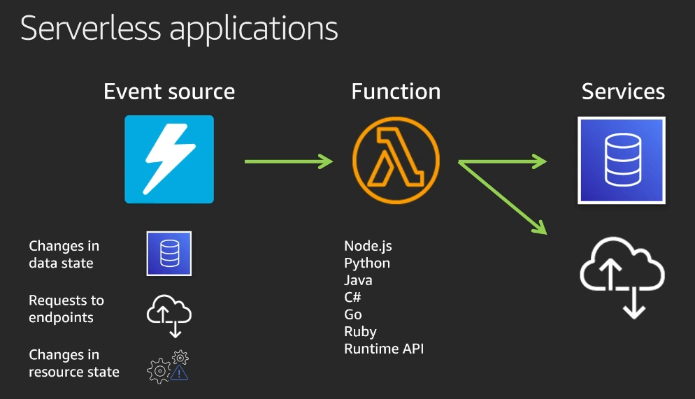

        - It can scale automatically, both *up* and *down*. You pay only for what you use.
        - Lambda Function Lifecycle

            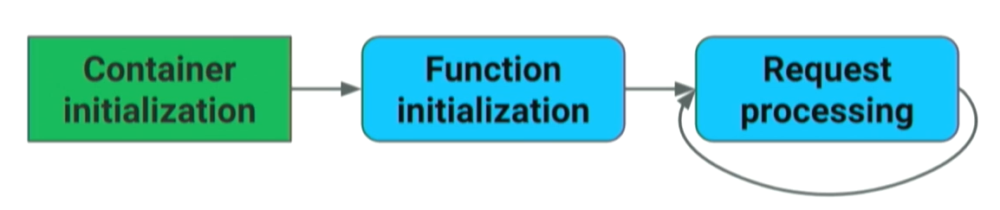

            - When our first request comes in, AWS creates a container for us and downloads our code into the container.
            - Then, our lambda functions are loaded into the memory.
            - Then, our function handlers are executed.
        - When should I use Lambda instead of EC2?
            - When I want events driven service.
            - When you expect the code you plan on running to run only a few times (thus saving you the money you would instead spend on idle servers).
        - When should I not use Lambda?
            - When you need to persist state between requests.
            - When your anticipated workload is mostly predictable and static.
            - When you don't want cold starts.
    - AWS API Gateway
        - What is it?
            - One way to access our Lambda functions from the outside world.

                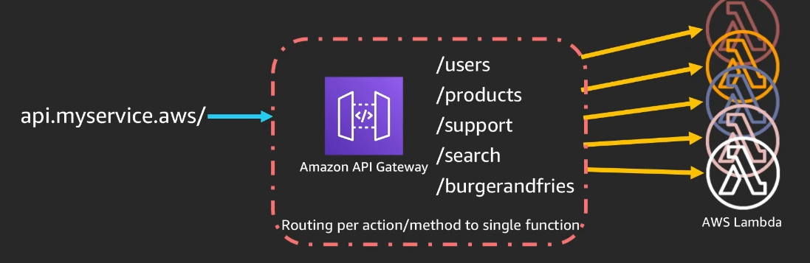

        - What is it, really?
            - A fully managed service for creating, publishing, maintaining, monitoring, and securing REST, HTTP or WebSocket APIs.
    - AWS Rekognition
        - What is it?
            - A SaaS for computer vision.
            - Does real-time image & video analysis using scalable deep learning.
        - Some capabilities
            - Identify objects, people, text, scenes, activities in images & videos.
            - Detect inappropriate content.
            - Highly accurate facial analysis & facial search.
            - Detect, analyze & compare faces, predict emotion from faces.
- Setup
    - I will be using JetBrains WebStorm as my IDE.
    - For configuring AWS Services, I use [AWS Toolkit for JetBrains](https://docs.aws.amazon.com/toolkit-for-jetbrains/latest/userguide/welcome.html).
    - I'll use `create-react-app` for setting up the React project.
- Let's Build 🛠️
    - Step 1: Write code that will run on Lambda and use Rekognition SDK ⚡
        - What will this code do?
            - If we give it a image, it will do some magic on it and return JSON result.
            - Magic → Utilize the SDK to "talk" to the Rekognition service, which will actually perform the "deep learning" operations and send us back the result
            - Lambda Function handler in NodeJS.
                - What's a function handler?
                    - function handler is the method in your function code that processes events.
                    - When your lambda is invoked, it runs the handler method.
                - The lambda runtime passes **three** arguments to the handler method:
                    1. `event`
                    2. `context`
                    3. `callback`
        - We will be referring [AWS SDK Documentation for Rekognition](https://docs.aws.amazon.com/rekognition/latest/dg/API_Reference.html) while writing the code
    - Step 2: Deploy what we have done to the cloud ☁️
        - Create and push our code to a Lambda function.
            - We'll need a S3 bucket to store the zip file of our code.
            - Thankfully, AWS Toolkit makes it very easy for us!
        - Configure API Gateway.
            - It should take the incoming client network request, and proxy it to our Lambda function.
            - Once our Lambda completes it's work, it should then take the response from Lambda and return it back to the client.
    - Step 3: Quickly set up a demo frontend for the API we created!
        - First, let's test the API using Postman to see what the response looks like
        - Create React App Boilerplate
        - We use `File` to read the user input image in base64 encoding and then use `fetch` to make a POST request to our API Gateway invoke URL.
        - For the results page, we will use HTML canvas to crop from the original image as per the bounding box and display it.